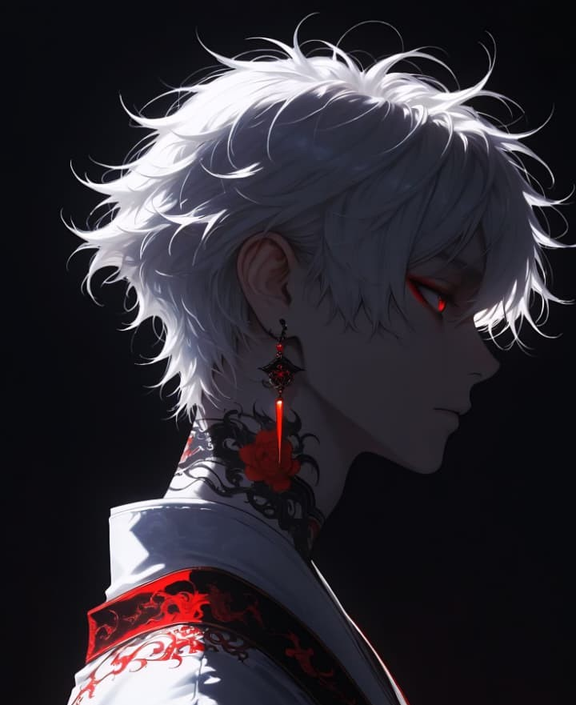
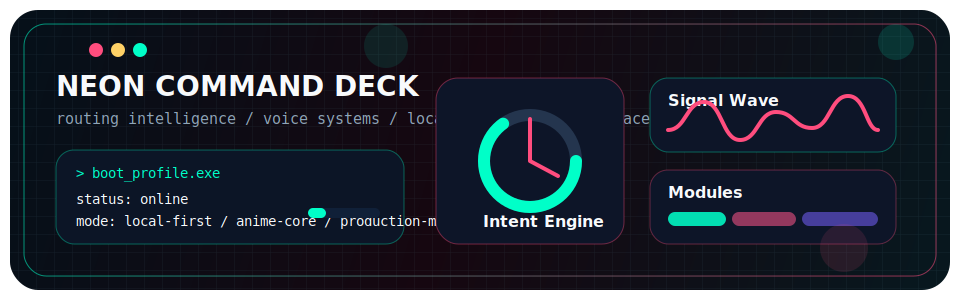
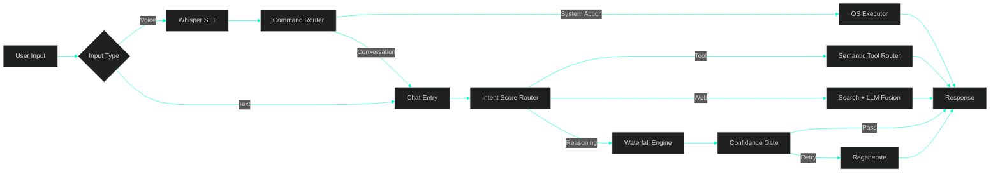

<div align="center">




### `AI Systems Architect` • `Offline-first Builder` • `Neon tinkerer`



<a href="https://git.io/typing-svg">
  
</a>

<br/>

<a href="https://github.com/ansh2222949?tab=followers">
  
</a>


</div>

---

<table>
<tr>
<td width="52%" valign="top">

<h2><code>&gt; whoami</code></h2>

<pre lang="yaml">name: Ace
role: AI Systems Architect
mission: Build sharp, local-first intelligence from scratch
base: localhost:5000
philosophy: "The system decides the path. The LLM only generates when needed."</pre>

<h2><code>&gt; current focus</code></h2>

<ul>
  <li>Routing engines over chatbot wrappers</li>
  <li>Whisper to LLM to GPT-SoVITS voice loops</li>
  <li>Gesture control and computer vision interfaces</li>
  <li>Offline-first tools that run on your machine</li>
  <li>UIs that feel cyberpunk, playful, and intentional</li>
</ul>

</td>
<td width="48%" valign="top" align="center">



<code>dragon.cat.exe</code><br/>
<sub>Guardian mode enabled for late-night builds.</sub>

</td>
</tr>
</table>

---

## `> command deck`

<table>
<tr>
<td width="33%" valign="top">
  <h3>Core Belief</h3>
  <p>System design comes first. The model is a component, not the product.</p>
</td>
<td width="33%" valign="top">
  <h3>Build Style</h3>
  <p>Offline-first, latency-aware, tool-enabled, and intentionally engineered.</p>
</td>
<td width="33%" valign="top">
  <h3>Visual Taste</h3>
  <p>Cyberpunk glow, motion, glass, and playful interfaces with actual purpose.</p>
</td>
</tr>
</table>

---

## ⚔️ Tech Arsenal

<div align="center">

**AI / ML**


**App / Web**


**Tooling**


</div>

---

## 🧪 System Snapshot

```text
+-------------------+--------------------------------------------------+
| Input Layer        | Text, voice, gesture                            |
| Decision Layer     | Intent scoring, semantic routing, tool gating   |
| Output Layer       | Actions, answers, TTS, visual feedback          |
| Philosophy         | Keep the stack local, sharp, and explainable    |
+-------------------+--------------------------------------------------+
```

---

## 🚀 Signature Projects

<table>
<tr>
<td width="50%" valign="top">
  <h3><a href="https://github.com/ansh2222949/NeonVoice-Core">⚡ NeonAI</a></h3>
  <p>Local-first AI system with semantic routing, tool calling, voice control, and confidence gating.</p>
  <p>
    
    
    
    
  </p>
</td>
<td width="50%" valign="top">
  <h3><a href="https://github.com/ansh2222949/ai-mouse">🖱️ AI Mouse</a></h3>
  <p>Hand-gesture mouse control powered by real-time computer vision and a hybrid ML pipeline.</p>
  <p>
    
    
    
  </p>
</td>
</tr>
<tr>
<td width="50%" valign="top">
  <h3><a href="https://github.com/ansh2222949/NeonPlayer">🎵 NeonPlayer</a></h3>
  <p>Offline desktop media control built from scratch for speed, focus, and zero cloud dependency.</p>
  <p>
    
    
    
  </p>
</td>
<td width="50%" valign="top">
  <h3><a href="https://github.com/ansh2222949/monument_ai">🏛️ Monument AI</a></h3>
  <p>Multi-modal CNN for monument recognition where deep learning meets cultural heritage.</p>
  <p>
    
    
    
  </p>
</td>
</tr>
</table>

---

## 🏗️ NeonAI Flow



---

## 🎛️ Build Zones

<div align="center">

| Zone | What Happens Here |
|:--|:--|
| `AI Systems` | Routing-first products, not thin chatbot wrappers |
| `Voice Pipelines` | Whisper STT -> LLM -> GPT-SoVITS TTS |
| `Computer Vision` | Gesture control, recognition, and real-time interaction |
| `Local-First Tools` | Fast, private, machine-native workflows |
| `UI Direction` | Glass, glow, motion, and cyberpunk personality |

</div>

---

## 📊 GitHub Pulse

<div align="center">


<br/><br/>


</div>

---

## ⚡ Philosophy

> "The system decides the path. The LLM only generates when needed."

<div align="center">

<sub>Designed like a character page. Built like an engineering workspace.</sub>

</div>

<div align="center">

### Thanks for visiting

<a href="https://github.com/ansh2222949">
  
</a>
<a href="https://github.com/ansh2222949?tab=repositories">
  
</a>
<a href="https://github.com/ansh2222949/NeonVoice-Core">
  
</a>

</div>


