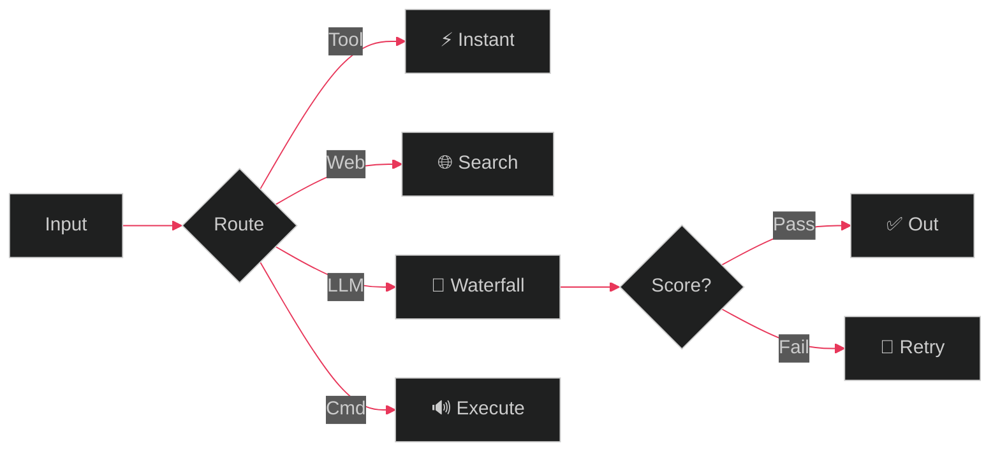

<div align="center">

<!-- ═══════════════════ HEADER ═══════════════════ -->


<!-- ═══════════════════ HERO ═══════════════════ -->


<br/>

# 𝕬𝖈𝖊 ♤

<a href="https://git.io/typing-svg">
  
</a>
<br/>
<a href="https://git.io/typing-svg">
  
</a>

<br/><br/>

<a href="https://github.com/ansh2222949?tab=followers">
  
</a>
&nbsp;
<a href="https://github.com/ansh2222949?tab=stars">
  
</a>
&nbsp;


</div>

---

<!-- ═══════════════════ ABOUT ═══════════════════ -->

<table>
<tr>
<td width="60%">

##  &nbsp; About

```js
const ace = {
    name:       "𝕬𝖈𝖊 ♤",
    title:      "AI Systems Architect",
    location:   "localhost:5000",
    focus:      ["AI Routing", "Voice AI",
                 "Computer Vision", "Local ML"],
    philosophy: "System > Model. Always."
};
```

</td>
<td width="40%" align="center">


</td>
</tr>
</table>

---

<!-- ═══════════════════ RPG STATS ═══════════════════ -->

##  &nbsp; Character Stats

<div align="center">

```
 ┌──────────────────────────────────────────┐
 │           𝕬𝖈𝖊 ♤  ·  LV 25               │
 │──────────────────────────────────────────│
 │                                          │
 │  ⚔️  AI Systems      ████████████░░  85  │
 │  🗡️  Voice Pipeline   ███████████░░░  80  │
 │  👁️  Computer Vision  ██████████░░░░  75  │
 │  🔧  Local-First ML   █████████████░  90  │
 │  🎨  UI / Frontend    ████████░░░░░░  60  │
 │  ⚡  System Design    ████████████░░  85  │
 │                                          │
 │  CLASS:  Architect    ELEMENT:  🔥 Fire  │
 │  TITLE:  卍解 Bankai  WEAPON:  🗡️ Code   │
 └──────────────────────────────────────────┘
```

</div>

---

<!-- ═══════════════════ TECH ═══════════════════ -->

<table>
<tr>
<td width="65%">

##  &nbsp; Arsenal

#### Core
<p>
  
  
  
  
  
  
  
</p>

#### Stack
<p>
  
  
  
  
  
</p>

#### Env
<p>
  
  
  
  
</p>

</td>
<td width="35%" align="center">


</td>
</tr>
</table>

---

<!-- ═══════════════════ ANIME DIVIDER ═══════════════════ -->
<div align="center">
  
</div>

---

<!-- ═══════════════════ PROJECTS ═══════════════════ -->

##  &nbsp; Creations

<div align="center">
<table>
<tr>
<td width="50%">

### [⚡ NeonAI](https://github.com/ansh2222949/NeonVoice-Core)
> Local AI with semantic routing, 5 modes, voice control & confidence gating. Zero cloud.

<sub>
  
  
  
  
</sub>

</td>
<td width="50%">

### [🖱️ AI Mouse](https://github.com/ansh2222949/ai-mouse)
> Hand gesture mouse control with real-time computer vision + hybrid ML.

<sub>
  
  
</sub>

</td>
</tr>
<tr>
<td width="50%">

### [🎵 NeonPlayer](https://github.com/ansh2222949/NeonPlayer)
> Offline desktop media controller. No internet, pure local.

<sub>
  
  
</sub>

</td>
<td width="50%">

### [🏛️ Monument AI](https://github.com/ansh2222949/monument_ai)
> CNN for monument recognition. Deep learning from scratch.

<sub>
  
  
</sub>

</td>
</tr>
</table>
</div>

---

<!-- ═══════════════════ ARCHITECTURE ═══════════════════ -->

<table>
<tr>
<td width="70%">

##  &nbsp; NeonAI Flow



</td>
<td width="30%" align="center">


</td>
</tr>
</table>

---

<!-- ═══════════════════ STATS ═══════════════════ -->

<div align="center">

<a href="https://github.com/ansh2222949">
  
</a>

<br/><br/>

<a href="https://github.com/ansh2222949">
  
</a>

</div>

---

<!-- ═══════════════════ ANIME DIVIDER ═══════════════════ -->
<div align="center">
  
</div>

---

<!-- ═══════════════════ FOOTER ═══════════════════ -->

<div align="center">


<br/>

```
  "The system decides the path.
   The LLM only generates when needed."
```

<sub>— NeonAI Philosophy</sub>

<br/><br/>

<a href="https://github.com/ansh2222949">
  
</a>
&nbsp;
<a href="https://github.com/ansh2222949?tab=repositories">
  
</a>

<br/><br/>


</div>


