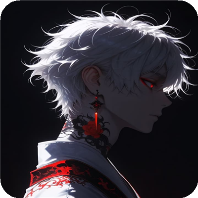
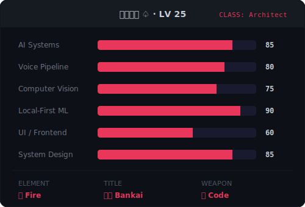
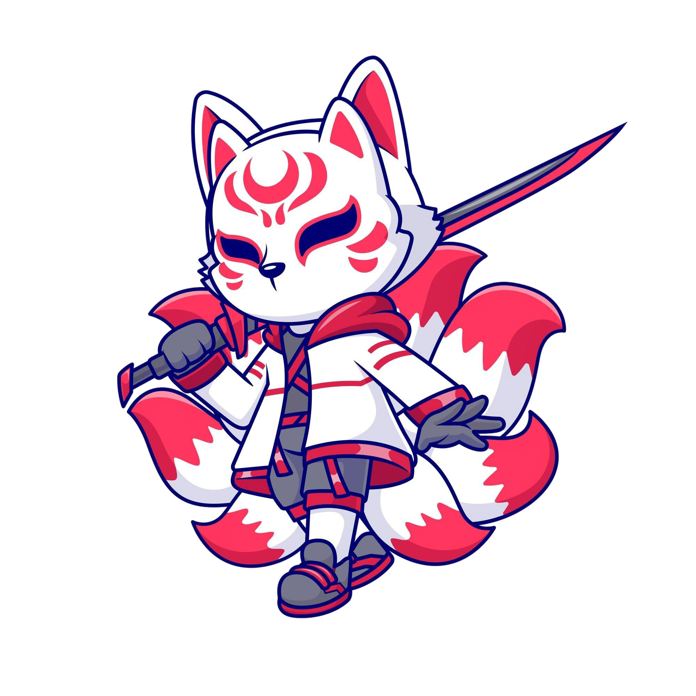
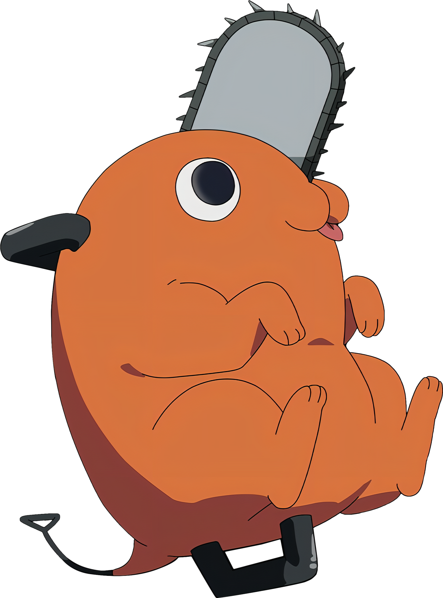
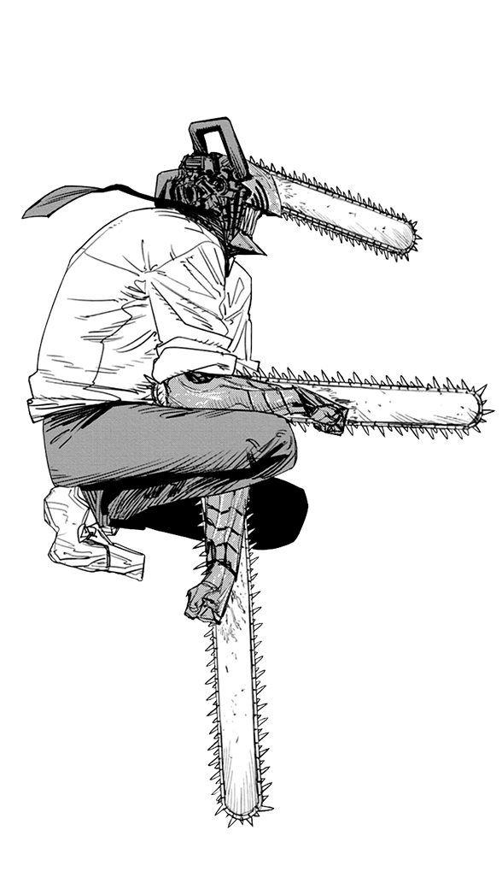
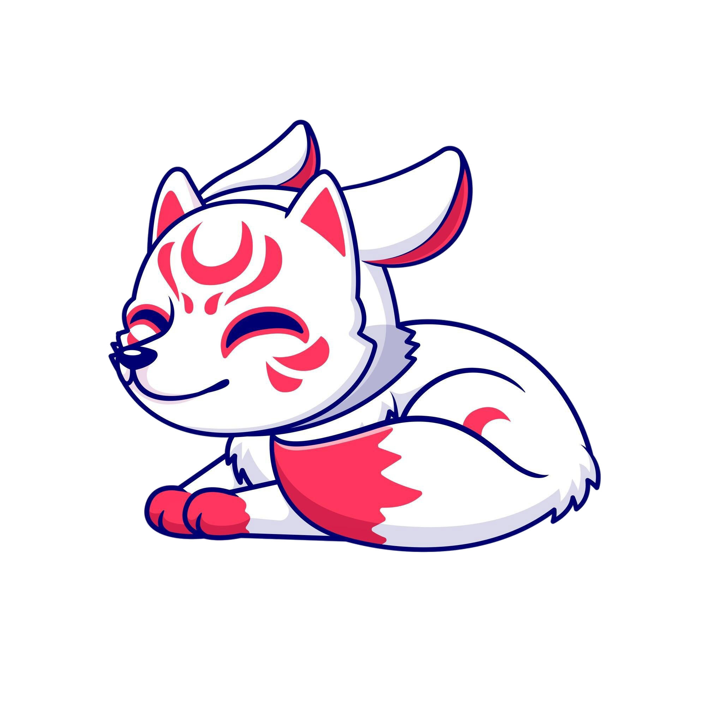

<div align="center">

<!-- ═══════════════════ HEADER ═══════════════════ -->


<!-- ═══════════════════ HERO ═══════════════════ -->



<br/>

# 𝕬𝖈𝖊 ♤

<a href="https://github.com/ansh2222949">
  
</a>
<br/>
<a href="https://github.com/ansh2222949">
  
</a>

<br/><br/>

<a href="https://github.com/ansh2222949?tab=followers">
  
</a>
&nbsp;
<a href="https://github.com/ansh2222949?tab=stars">
  
</a>
&nbsp;


</div>

---

<!-- ═══════════════════ ABOUT ═══════════════════ -->

<table>
<tr>
<td width="60%" valign="top">

##  &nbsp; About

```js
const ace = {
    name:       "𝕬𝖈𝖊 ♤",
    title:      "AI Systems Architect",
    location:   "localhost:5000",
    focus:      ["AI Routing", "Voice AI",
                 "Computer Vision", "Local ML"],
    philosophy: "System > Model. Always."
};
```

</td>
<td width="40%" align="center" valign="top">


</td>
</tr>
</table>

---

<!-- ═══════════════════ RPG STATS ═══════════════════ -->

<div align="center">

##  &nbsp; Character Stats



</div>

---

<!-- ═══════════════════ TECH ═══════════════════ -->

<table>
<tr>
<td width="65%" valign="top">

##  &nbsp; Arsenal

#### Core
<p>
  
  
  
  
  
  
  
</p>

#### Stack
<p>
  
  
  
  
  
</p>

#### Env
<p>
  
  
  
  
</p>

</td>
<td width="35%" align="center" valign="center">



</td>
</tr>
</table>

---

<!-- ═══════════════════ ANIME DIVIDER ═══════════════════ -->
<div align="center">
  
</div>

---

<!-- ═══════════════════ PROJECTS ═══════════════════ -->

##  &nbsp; Creations

<div align="center">
<table>
<tr>
<td width="50%" valign="top">

<h3 align="center"><a href="https://github.com/ansh2222949/NeonVoice-Core">⚡ NeonAI</a></h3>
<p align="center"><sub>Local AI with semantic routing, 5 modes, voice control & confidence gating. Zero cloud.</sub></p>
<p align="center">
  
  
  
  
</p>

</td>
<td width="50%" valign="top">

<h3 align="center"><a href="https://github.com/ansh2222949/ai-mouse">🖱️ AI Mouse</a></h3>
<p align="center"><sub>Hand gesture mouse control with real-time computer vision + hybrid ML.</sub></p>
<p align="center">
  
  
  
</p>

</td>
</tr>
<tr>
<td width="50%" valign="top">

<h3 align="center"><a href="https://github.com/ansh2222949/NeonPlayer">🎵 NeonPlayer</a></h3>
<p align="center"><sub>Offline desktop media controller built from scratch. No internet, pure local power.</sub></p>
<p align="center">
  
  
  
</p>

</td>
<td width="50%" valign="top">

<h3 align="center"><a href="https://github.com/ansh2222949/monument_ai">🏛️ Monument AI</a></h3>
<p align="center"><sub>Multi-modal CNN for monument recognition. Deep learning built from scratch.</sub></p>
<p align="center">
  
  
  
</p>

</td>
</tr>
</table>
</div>

---

<!-- ═══════════════════ ARCHITECTURE ═══════════════════ -->

<div align="center">

##  &nbsp; NeonAI Flow

<table>
<tr>
<td align="center" valign="middle">

```
  Input ─→ Route ─┬─→ Tool Call ──→ ⚡ Instant Response
                   │
                   ├─→ Web Search ─→ 🌐 Search + LLM
                   │
                   ├─→ LLM Mode ──→ 🧠 Waterfall Engine
                   │                       │
                   │                  Confidence Gate
                   │                   ├─ ✅ Pass → Out
                   │                   └─ ❌ Fail → Retry
                   │
                   └─→ System CMD ─→ 🔊 OS Execute
```

</td>
<td width="200" align="center" valign="middle">



</td>
</tr>
</table>

</div>

---

<!-- ═══════════════════ GITHUB STATS ═══════════════════ -->

<div align="center">

<a href="https://github.com/ansh2222949">
  
</a>

<br/><br/>

<a href="https://github.com/ansh2222949">
  
</a>

</div>

---

<!-- ═══════════════════ ANIME DIVIDER ═══════════════════ -->
<div align="center">
  
</div>

---

<!-- ═══════════════════ FOOTER ═══════════════════ -->

<div align="center">



<br/><br/>

> *"The system decides the path. The LLM only generates when needed."*
> 
> — NeonAI Philosophy

<br/>

<a href="https://github.com/ansh2222949">
  
</a>
&nbsp;
<a href="https://github.com/ansh2222949?tab=repositories">
  
</a>

<br/><br/>



</div>


