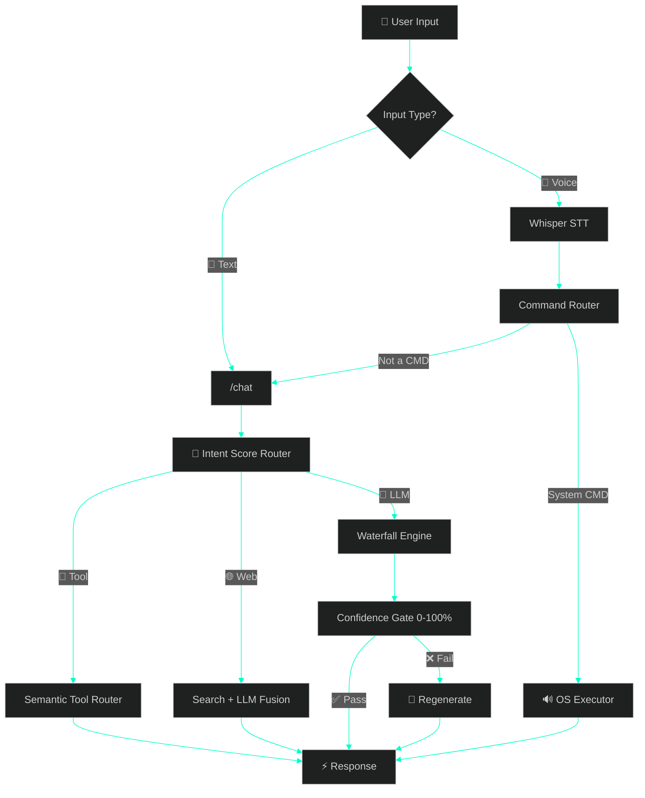

<div align="center">

<!-- ═══════════════════════════════ HEADER ═══════════════════════════════ -->


<!-- ═══════════════════════════════ AVATAR ═══════════════════════════════ -->


<br/><br/>

<!-- ═══════════════════════════════ TYPING SVG ═══════════════════════════════ -->
<a href="https://git.io/typing-svg">
  
</a>
<br/>
<a href="https://git.io/typing-svg">
  
</a>

<br/><br/>

<!-- ═══════════════════════════════ BADGES ═══════════════════════════════ -->
<a href="https://github.com/ansh2222949?tab=followers">
  
</a>
&nbsp;
<a href="https://github.com/ansh2222949?tab=stars">
  
</a>
&nbsp;


</div>

<!-- ═══════════════════════════════ DIVIDER ═══════════════════════════════ -->


<!-- ═══════════════════════════════ ABOUT ME ═══════════════════════════════ -->
## 🥷 &nbsp; `> whoami`

```js
class Ace {
    constructor() {
        this.name     = "𝕬𝖈𝖊 ♤";
        this.title    = "AI Systems Architect";
        this.bankai   = "𝔹𝔸ℕ𝕂𝔸𝕀: 𝔾𝕖𝕥𝕤𝕦𝕘𝕒 𝕋𝕖𝕟𝕤𝕙ō 🗡️🔥";
        this.location = "localhost:5000";
    }

    get focus() {
        return [
            "🧠 AI Routing Systems",
            "🎤 Voice Pipelines (Whisper → GPT-SoVITS)",
            "👁️ Computer Vision & Gesture Control",
            "🔧 Offline-First Local Intelligence"
        ];
    }

    get philosophy() {
        return "The system decides the path. The LLM only generates when needed.";
    }
}
```


<!-- ═══════════════════════════════ TECH STACK ═══════════════════════════════ -->
## ⚔️ &nbsp; Tech Arsenal

<div align="center">

### `🧠 AI / Machine Learning`
<p>
  
  
  
  
  
  
  
  
</p>

### `🌐 Backend & Frontend`
<p>
  
  
  
  
  
</p>

### `🛠️ Tools & Environment`
<p>
  
  
  
  
  
</p>

</div>


<!-- ═══════════════════════════════ PROJECTS ═══════════════════════════════ -->
## 🚀 &nbsp; Featured Creations

<div align="center">
<table>
<tr>
<td width="50%">

### [⚡ NeonAI](https://github.com/ansh2222949/NeonVoice-Core)
> 🧠 Local-first AI system with semantic routing, 5 modes, tool calling, voice control & confidence gating. **Zero cloud dependency.**

<p>
  
  
  
  
</p>

</td>
<td width="50%">

### [🖱️ AI Mouse](https://github.com/ansh2222949/ai-mouse)
> ✋ Control your mouse with hand gestures — real-time computer vision + hybrid ML pipeline.

<p>
  
  
  
</p>

</td>
</tr>
<tr>
<td width="50%">

### [🎵 NeonPlayer](https://github.com/ansh2222949/NeonPlayer)
> 🎶 Offline desktop media controller built from scratch — no internet, pure local power.

<p>
  
  
  
</p>

</td>
<td width="50%">

### [🏛️ Monument AI](https://github.com/ansh2222949/monument_ai)
> 🏛️ Multi-modal CNN for monument recognition — deep learning meets cultural heritage. Built from scratch.

<p>
  
  
  
</p>

</td>
</tr>
</table>
</div>


<!-- ═══════════════════════════════ ARCHITECTURE ═══════════════════════════════ -->
## 🏗️ &nbsp; NeonAI — How It Works

<div align="center">



</div>


<!-- ═══════════════════════════════ STATS ═══════════════════════════════ -->
## 📊 &nbsp; GitHub Analytics

<div align="center">

<!-- STREAK - Most reliable -->
<a href="https://github.com/ansh2222949">
  
</a>

<br/><br/>

<!-- ACTIVITY GRAPH -->
<a href="https://github.com/ansh2222949">
  
</a>

</div>


<!-- ═══════════════════════════════ WHAT I BUILD ═══════════════════════════════ -->
## ⚡ &nbsp; What I Build

<div align="center">

| | Domain | What I Do |
|:---:|:---|:---|
| 🧠 | **AI Systems** | Routing engines, not chatbot wrappers |
| 🎤 | **Voice Pipelines** | Whisper STT ➜ LLM ➜ GPT-SoVITS TTS |
| 👁️ | **Computer Vision** | Gesture control, CNN recognition |
| 🔧 | **Local-First Tools** | Everything runs on YOUR machine |
| 🎬 | **Smart UIs** | Glassmorphism, dark themes, animations |
| 🗡️ | **Philosophy** | System > Model. Always. |

</div>


<!-- ═══════════════════════════════ QUOTE + CTA ═══════════════════════════════ -->
<div align="center">

<br/>

```
  ╔═══════════════════════════════════════════════════════════════╗
  ║                                                               ║
  ║   "The system decides the path.                               ║
  ║    The LLM only generates when needed."                       ║
  ║                                                               ║
  ║                              — NeonAI Philosophy              ║
  ║                                                               ║
  ╚═══════════════════════════════════════════════════════════════╝
```

<br/>

### 🤝 𝕿𝖍𝖆𝖓𝖐𝖘 𝖋𝖔𝖗 𝖛𝖎𝖘𝖎𝖙𝖎𝖓𝖌 ♤

<a href="https://github.com/ansh2222949">
  
</a>
&nbsp;
<a href="https://github.com/ansh2222949?tab=repositories">
  
</a>
&nbsp;
<a href="https://github.com/ansh2222949/NeonVoice-Core">
  
</a>

<br/><br/>

</div>

<!-- ═══════════════════════════════ FOOTER ═══════════════════════════════ -->

