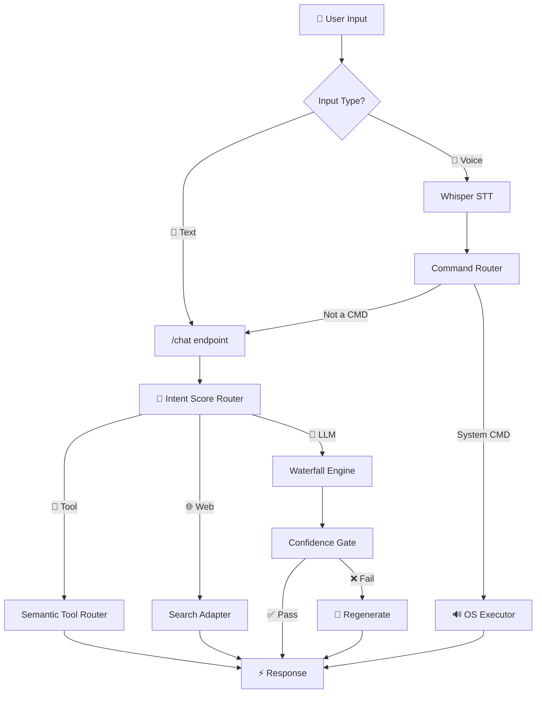

<div align="center">

<!-- ═══════════════════════════════ ANIMATED HEADER ═══════════════════════════════ -->


<!-- ═══════════════════════════════ HERO IMAGE ═══════════════════════════════ -->


<br/><br/>

<!-- ═══════════════════════════════ TYPING SVG ═══════════════════════════════ -->
<a href="https://git.io/typing-svg">
  
</a>

<br/>

<!-- ═══════════════════════════════ SOCIAL BADGES ═══════════════════════════════ -->
<a href="https://github.com/ansh2222949?tab=followers">
  
</a>
&nbsp;
<a href="https://github.com/ansh2222949?tab=stars">
  
</a>
&nbsp;


</div>

<!-- ═══════════════════════════════ ANIMATED DIVIDER ═══════════════════════════════ -->
<p align="center">
  
</p>

<!-- ═══════════════════════════════ ABOUT ME ═══════════════════════════════ -->
##  &nbsp; `> whoami`


```js
class Ace {
    constructor() {
        this.name     = "𝕬𝖈𝖊 ♤";
        this.title    = "AI Systems Architect";
        this.bankai   = "𝔹𝔸ℕ𝕂𝔸𝕀: 𝔾𝕖𝕥𝕤𝕦𝕘𝕒 𝕋𝕖𝕟𝕤𝕙ō 🗡️🔥";
        this.location = "localhost:5000";
    }

    get focus() {
        return [
            "🧠 AI Routing Systems",
            "🎤 Voice Pipelines (Whisper → GPT-SoVITS)",
            "👁️ Computer Vision & Gesture Control",
            "🔧 Offline-First Local Intelligence"
        ];
    }

    get philosophy() {
        return "The system decides the path. The LLM only generates when needed.";
    }
}
```

<p align="center">
  
</p>

<!-- ═══════════════════════════════ TECH STACK ═══════════════════════════════ -->
##  &nbsp; Tech Arsenal

<div align="center">

### `🧠 AI / Machine Learning`
<p>
  <a href="#"></a>
  <a href="#"></a>
  <a href="#"></a>
  <a href="#"></a>
  <a href="#"></a>
  <a href="#"></a>
  <a href="#"></a>
  <a href="#"></a>
</p>

### `🌐 Backend & Web`
<p>
  <a href="#"></a>
  <a href="#"></a>
  <a href="#"></a>
  <a href="#"></a>
  <a href="#"></a>
</p>

### `🛠️ Tools & Platforms`
<p>
  <a href="#"></a>
  <a href="#"></a>
  <a href="#"></a>
  <a href="#"></a>
  <a href="#"></a>
</p>

</div>

<p align="center">
  
</p>

<!-- ═══════════════════════════════ FEATURED PROJECTS ═══════════════════════════════ -->
##  &nbsp; Featured Creations

<div align="center">
<table>
<tr>
<td width="50%" valign="top">

<h3 align="center">
  
  NeonAI
</h3>
<div align="center">
<a href="https://github.com/ansh2222949/NeonVoice-Core">
  
</a>
</div>
<p align="center">
  
  
  
</p>
<p align="center"><sub>🧠 Local AI system with semantic routing, 5 modes, tool calling, voice control & confidence gating. Zero cloud dependency.</sub></p>

</td>
<td width="50%" valign="top">

<h3 align="center">
  
  AI Mouse
</h3>
<div align="center">
<a href="https://github.com/ansh2222949/ai-mouse">
  
</a>
</div>
<p align="center">
  
  
</p>
<p align="center"><sub>✋ Control your mouse with hand gestures — real-time computer vision + hybrid ML pipeline.</sub></p>

</td>
</tr>
<tr>
<td width="50%" valign="top">

<h3 align="center">
  
  NeonPlayer
</h3>
<div align="center">
<a href="https://github.com/ansh2222949/NeonPlayer">
  
</a>
</div>
<p align="center">
  
  
</p>
<p align="center"><sub>🎶 Offline desktop media controller built from scratch — no internet, pure local power.</sub></p>

</td>
<td width="50%" valign="top">

<h3 align="center">
  
  Monument AI
</h3>
<div align="center">
<a href="https://github.com/ansh2222949/monument_ai">
  
</a>
</div>
<p align="center">
  
  
</p>
<p align="center"><sub>🏛️ Multi-modal CNN for monument recognition — deep learning meets cultural heritage. Built from scratch.</sub></p>

</td>
</tr>
</table>
</div>

<p align="center">
  
</p>

<!-- ═══════════════════════════════ GITHUB STATS ═══════════════════════════════ -->
##  &nbsp; GitHub Analytics

<div align="center">

<a href="https://github.com/ansh2222949">
  
</a>
&nbsp;&nbsp;
<a href="https://github.com/ansh2222949">
  
</a>

<br/><br/>

<!-- STREAK -->
<a href="https://github.com/ansh2222949">
  
</a>

<br/><br/>

<!-- ACTIVITY GRAPH -->
<a href="https://github.com/ansh2222949">
  
</a>

<br/><br/>

<!-- TROPHIES -->
<a href="https://github.com/ansh2222949">
  
</a>

</div>

<p align="center">
  
</p>

<!-- ═══════════════════════════════ WHAT I BUILD ═══════════════════════════════ -->
##  &nbsp; What I Build

<div align="center">

```
 ╔══════════════════════════════════════════════════════════════════════╗
 ║                                                                      ║
 ║   🧠  AI Systems        →  Routing engines, not chatbot wrappers    ║
 ║   🎤  Voice Pipelines    →  Whisper STT ➜ LLM ➜ GPT-SoVITS TTS     ║
 ║   👁️  Computer Vision    →  Gesture control, CNN recognition        ║
 ║   🔧  Local-First Tools  →  Everything runs on YOUR machine         ║
 ║   🎬  Smart UIs          →  Glassmorphism, dark themes, animations  ║
 ║   🗡️  Philosophy         →  System > Model. Always.                 ║
 ║                                                                      ║
 ╚══════════════════════════════════════════════════════════════════════╝
```

</div>

<p align="center">
  
</p>

<!-- ═══════════════════════════════ NEONAI ARCHITECTURE ═══════════════════════════════ -->
##  &nbsp; NeonAI — How It Works

<div align="center">



</div>

<p align="center">
  
</p>

<!-- ═══════════════════════════════ QUOTE ═══════════════════════════════ -->
<div align="center">


<br/><br/>


### 𝕿𝖍𝖆𝖓𝖐𝖘 𝖋𝖔𝖗 𝖛𝖎𝖘𝖎𝖙𝖎𝖓𝖌 ♤

<a href="https://github.com/ansh2222949">
  
</a>
&nbsp;
<a href="https://github.com/ansh2222949?tab=repositories">
  
</a>

</div>

<br/>

<!-- ═══════════════════════════════ FOOTER ═══════════════════════════════ -->
<div align="center">

</div>
