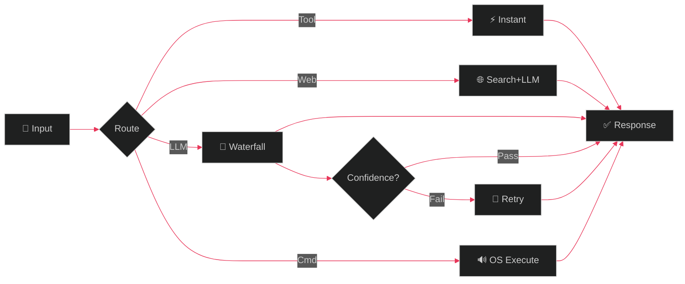

<div align="center">

<!-- ═══════════════════ HEADER ═══════════════════ -->


<!-- ═══════════════════ HERO SECTION ═══════════════════ -->


<br/>

# 𝕬𝖈𝖊 ♤

<a href="https://git.io/typing-svg">
  
</a>
<br/>
<a href="https://git.io/typing-svg">
  
</a>

<br/>

<a href="https://github.com/ansh2222949?tab=followers">
  
</a>
&nbsp;&nbsp;
<a href="https://github.com/ansh2222949?tab=stars">
  
</a>
&nbsp;&nbsp;


<br/><br/>


</div>

<br/>

<!-- ═══════════════════ ABOUT ═══════════════════ -->


## 狐 &nbsp; About

```js
const ace = {
    name:       "𝕬𝖈𝖊 ♤",
    title:      "AI Systems Architect",
    bankai:     "卍解 • Getsuga Tenshō 🗡️",
    location:   "localhost:5000",
    focus:      ["AI Routing", "Voice AI", "Computer Vision", "Local-First ML"],
    philosophy: "System > Model. Always."
};
```

<br/>

<!-- ═══════════════════ TECH ═══════════════════ -->


## 刀 &nbsp; Arsenal

<div align="center">
<p>
  
  
  
  
  
  
  
  
  
  
  
  
</p>
</div>

<br/>

<!-- ═══════════════════ ANIME DIVIDER ═══════════════════ -->
<div align="center">
  
</div>

<br/>

<!-- ═══════════════════ PROJECTS ═══════════════════ -->
## 巻 &nbsp; Creations

<div align="center">
<table>
<tr>
<td width="50%">

### [⚡ NeonAI](https://github.com/ansh2222949/NeonVoice-Core)
> Local AI system with semantic routing, 5 modes, tool calling, voice control & confidence gating

<sub>
  
  
  
  
</sub>

</td>
<td width="50%">

### [🖱️ AI Mouse](https://github.com/ansh2222949/ai-mouse)
> Real-time hand gesture controlled mouse using computer vision and hybrid ML

<sub>
  
  
  
</sub>

</td>
</tr>
<tr>
<td width="50%">

### [🎵 NeonPlayer](https://github.com/ansh2222949/NeonPlayer)
> Offline desktop media controller built from scratch with pywebview

<sub>
  
  
</sub>

</td>
<td width="50%">

### [🏛️ Monument AI](https://github.com/ansh2222949/monument_ai)
> Multi-modal CNN for monument recognition built from scratch

<sub>
  
  
</sub>

</td>
</tr>
</table>
</div>

<br/>

<!-- ═══════════════════ ARCHITECTURE ═══════════════════ -->
## 術 &nbsp; NeonAI Architecture

<div align="center">



</div>

<br/>

<!-- ═══════════════════ ANIME DIVIDER ═══════════════════ -->
<div align="center">
  
</div>

<br/>

<!-- ═══════════════════ STATS ═══════════════════ -->
## 力 &nbsp; Stats

<div align="center">

<a href="https://github.com/ansh2222949">
  
</a>

<br/><br/>

<a href="https://github.com/ansh2222949">
  
</a>

</div>

<br/>

<!-- ═══════════════════ PHILOSOPHY ═══════════════════ -->
<div align="center">

```
  "The system decides the path.
   The LLM only generates when needed."
```

<sub>— NeonAI Philosophy</sub>

<br/><br/>

<a href="https://github.com/ansh2222949">
  
</a>
&nbsp;
<a href="https://github.com/ansh2222949?tab=repositories">
  
</a>

<br/><br/>


</div>

<!-- ═══════════════════ FOOTER ═══════════════════ -->

