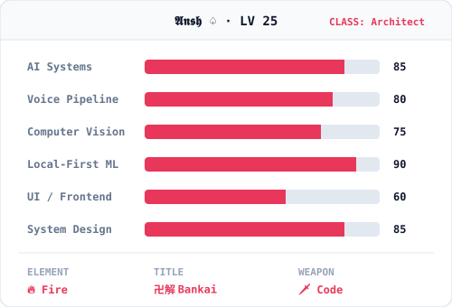
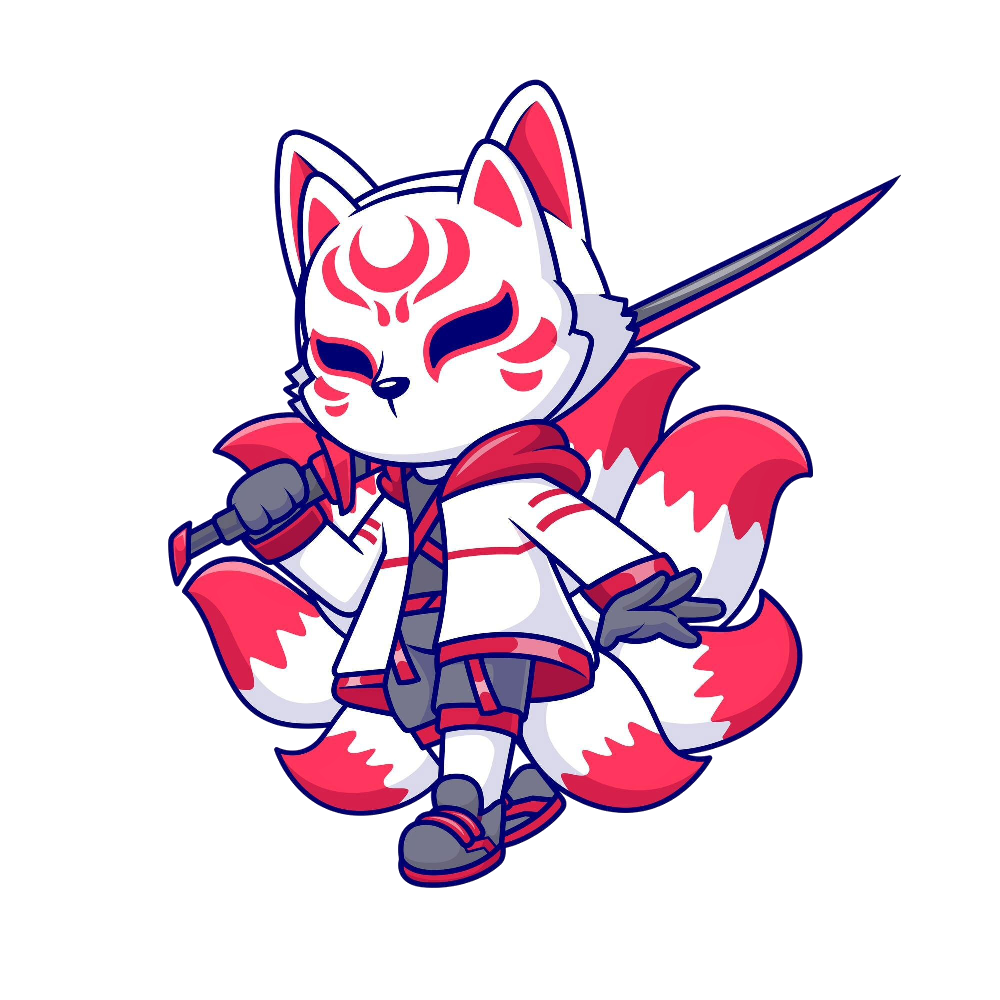
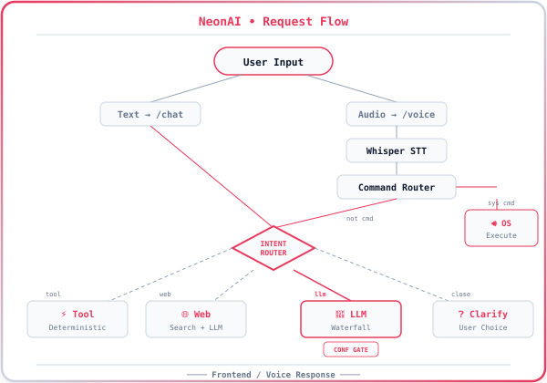
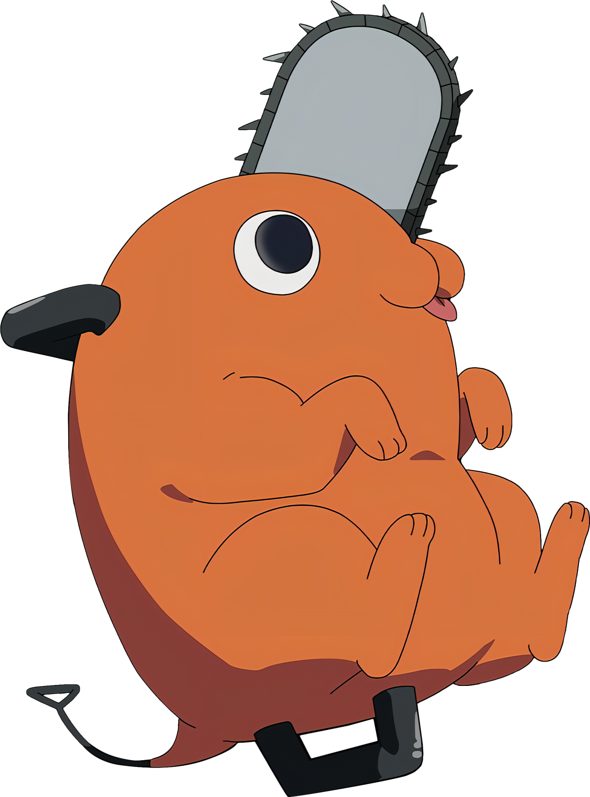
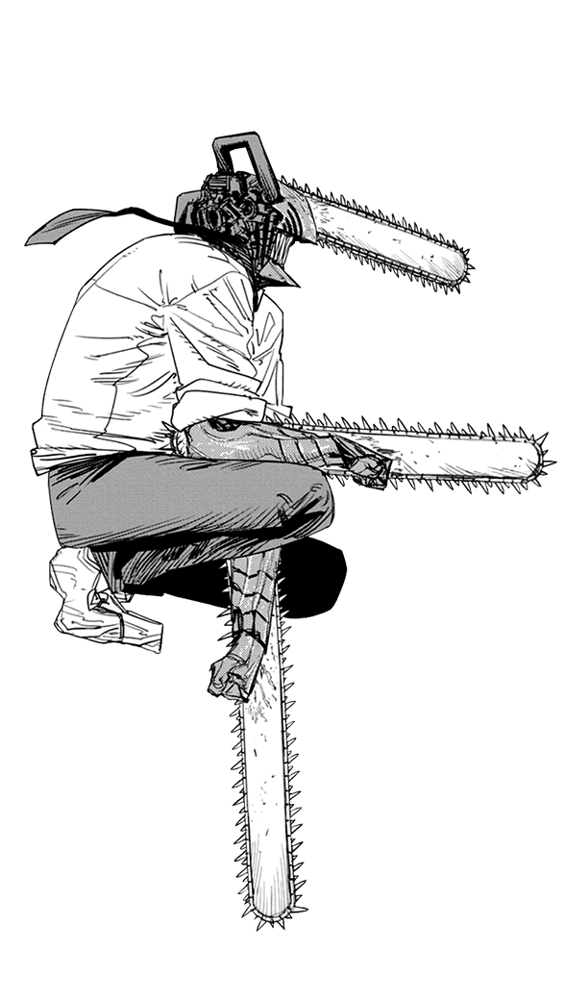
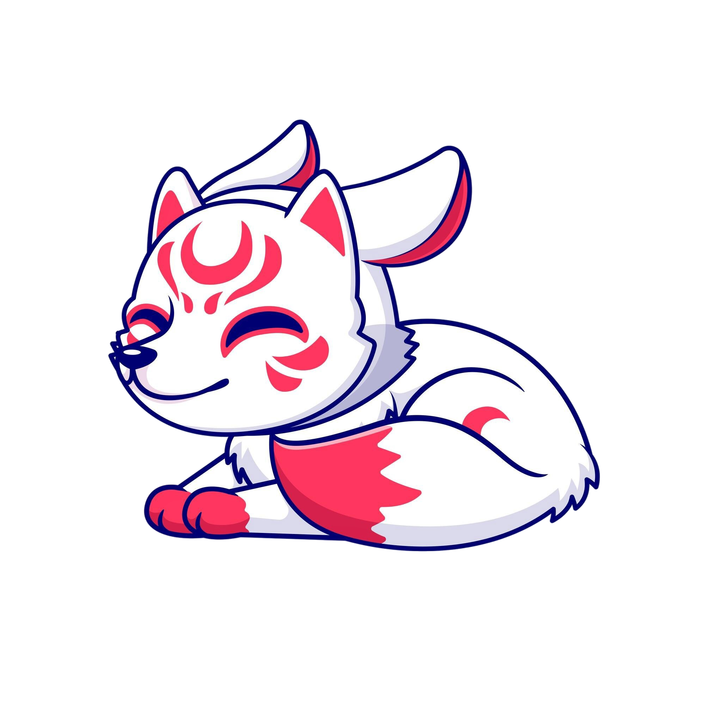

<!-- ═══════════════════ HEADER WALLPAPER BANNER ═══════════════════ -->

  

<!-- ═══════════════════ HERO ═══════════════════ -->

 

# 𝕬𝖓𝖘𝖍 ♤

 

  

&nbsp;

&nbsp;

<!-- ═══════════════════ GLOW DIVIDER ═══════════════════ -->

<!-- ═══════════════════ ABOUT ═══════════════════ -->

##  &nbsp; About Me

  

<!-- ═══════════════════ GLOW DIVIDER ═══════════════════ -->

<!-- ═══════════════════ RPG STATS ═══════════════════ -->

##  &nbsp; Character Stats

<!-- ═══════════════════ GLOW DIVIDER ═══════════════════ -->

<!-- ═══════════════════ TECH ═══════════════════ -->

<table>
<tr>
<td width="65%" valign="top">

##  &nbsp; Arsenal

#### Core & AI Frameworks

  
  
  
  
  
  
  

#### Web & Desktop Tech Stack

  
  
  
  
  
  
  

#### Environment & Hardware

  
  
  
  

</td>
<td width="35%" align="center" valign="center">

</td>
</tr>
</table>

<!-- ═══════════════════ GLOW DIVIDER ═══════════════════ -->

<!-- ═══════════════════ ANIME DIVIDER ═══════════════════ -->

  

<!-- ═══════════════════ GLOW DIVIDER ═══════════════════ -->

<!-- ═══════════════════ CREATIONS ═══════════════════ -->

##  &nbsp; Featured Creations

  

&nbsp;

<!-- ═══════════════════ GLOW DIVIDER ═══════════════════ -->

<!-- ═══════════════════ ARCHITECTURE ═══════════════════ -->

##  &nbsp; NeonAI Architecture

 

<!-- ═══════════════════ GLOW DIVIDER ═══════════════════ -->

<!-- ═══════════════════ CONTRIBUTIONS & STATS ═══════════════════ -->

##  &nbsp; Contributions & Metrics

<picture>
  <source media="(prefers-color-scheme: light)" srcset="https://raw.githubusercontent.com/ansh2222949/ansh2222949/output/snake-light.svg" />
  
</picture>

  

  

<!-- ═══════════════════ GLOW DIVIDER ═══════════════════ -->

<!-- ═══════════════════ ANIME DIVIDER ═══════════════════ -->

  

<!-- ═══════════════════ GLOW DIVIDER ═══════════════════ -->

<!-- ═══════════════════ FOOTER ═══════════════════ -->

  

> *"The system decides the path. The LLM only generates when needed."*
> 
> — NeonAI Philosophy

 

&nbsp;

  

